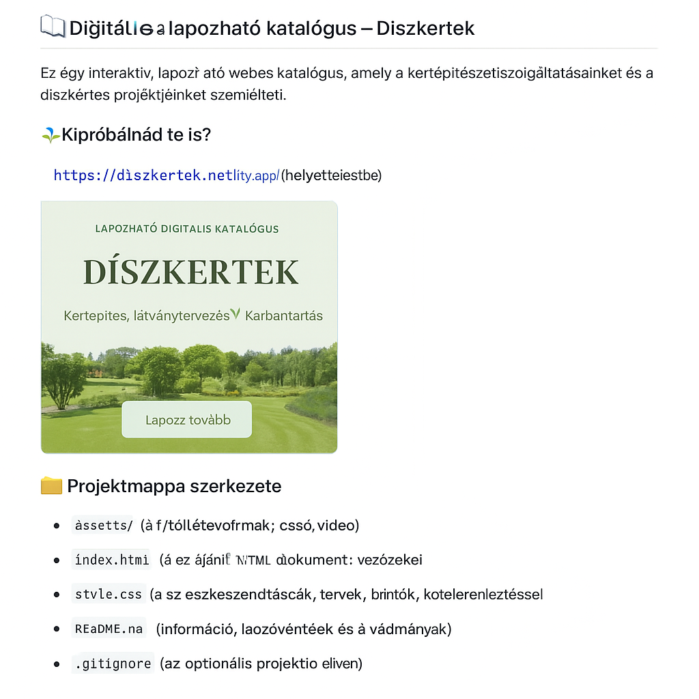

# flipcatalog# Díszkertek – Digitális katalógus

Ez a projekt egy interaktív, lapozható webes katalógus, amely bemutatja a Díszkertek csapatának munkáját, szolgáltatásait és referenciáit. 🌿

## Fő jellemzők

- ✅ Bootstrap alapú reszponzív felépítés
- 🎬 Videós bemutató oldalak
- 🌱 Termék- és szolgáltatásismertetők
- 📲 QR-kódos kapcsolatfelvétel
- ✨ Beúszó animációk, modern stílus

## Elérhető Netlify-on

👉 [Megtekintés online](https://<netlify-link-helye>) *(link frissítendő deploy után)*

## Használat

1. Klónozd vagy töltsd le a projektet
2. Nyisd meg az `index.html` fájlt böngészőben
3. Vagy telepítsd online GitHub + Netlify segítségével

## Képernyőkép

